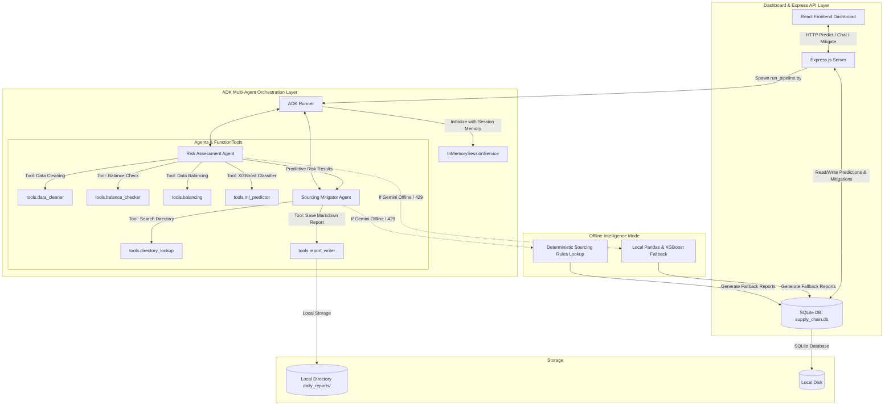

# ASBA: Autonomous Supply Chain Bottleneck Agent

ASBA is a supply chain risk analysis system designed for garment manufacturing companies. By combining a predictive machine learning classifier (XGBoost) with generative multi-agent reasoning (Gemini), ASBA predicts late delivery risks on active orders and recommends sourcing mitigations.

This project was built for the Kaggle AI Agents: Intensive Vibe Coding Capstone Project with Google.

---

## System Architecture

ASBA uses a multi-agent coordination flow built on Google's GenAI SDK and Model Context Protocol (MCP), coordinated programmatically via the Google Agent Development Kit (ADK).



### The Orchestration Workflow
1. Trigger: A script or API request runs backend/run_pipeline.py, executing the ADK multi-agent loop.
2. Risk Assessment Agent (Risk Analyst): Cleans the input data, handles class imbalance using SMOTE oversampling, and trains the XGBoost model to predict delivery status.
3. Sourcing Mitigator Agent (Sourcing Specialist): Processes the high-risk orders, searches the supplier directory for alternative materials, analyzes cost exposures, and generates a markdown report.
4. React Dashboard and Express API: Displays order statuses and risk charts. Users can trigger predictions or click "Mitigate" to change order logistics parameters, running model re-inference to recalculate risks.

---

## Applied Course Concepts

ASBA implements five core concepts from the Google AI Agents course:

### 1. ADK Multi-Agent Orchestration
The multi-agent loop is built on Google's official Agent Development Kit (ADK):
* Agent: Encapsulates instructions and parameters for both the RiskAssessmentAgent and SourcingMitigatorAgent.
* FunctionTool: Exposes native Python functions (cleaning, predicting, supplier search) as agent tools.
* Runner: Coordinates the sequential handover of state from the Analyst agent to the Mitigator agent.

### 2. Session Memory
ASBA uses ADK's InMemorySessionService to track chat conversation history.
* Chat contexts are tracked using a unique session ID.
* Conversations are modeled as ADK Event logs and passed back to the Sourcing Specialist on subsequent turns.
* This allows the agent to answer follow-up questions, compare sourcing alternatives, and retain context.

### 3. Model Context Protocol (MCP) Server
ASBA exposes its supply chain tools via an MCP server built with the Python mcp library:
* Exposes tools like search_supplier_directory and train_and_predict_risk.
* Allows any MCP-compliant client (like Cursor or Claude Desktop) to connect and run predictions.

### 4. Input Regex Security Sanitization
ASBA validates input arguments at two layers:
* Express API: Validates parameters using custom middleware regexes before spawning backend scripts.
* Python Tools: Uses compiled regex patterns to sanitize Order IDs and alphanumeric strings before querying SQLite or performing XGBoost model predictions.

### 5. Production GCP Configs & Local Hosting
* Google Cloud Run Configs: A Dockerfile and deploy_gcp.sh script are provided for building and deploying the container to GCP.
* Local Sourcing: Due to active GCP billing account requirements, we host and run the application locally for evaluation and recording.
* Local Fallback: If Gemini API limits or quotas are hit, the system automatically falls back to local XGBoost inference and deterministic supplier directory lookups to keep the application running.

---

## Directory Structure

Here is an overview of the project layout:

```text
d:/Project Capstone Kaggle
├── agent/                       # ADK Multi-Agent definition and loop
│   ├── __init__.py
│   ├── react_loop.py            # Primary ADK agent runner
│   └── tool_definitions.py      # Registers tools for Analyst and Mitigator
├── backend/                     # Node.js API server & Python entrypoints
│   ├── chat_agent.py            # Chat wrapper using ADK Session
│   ├── mitigate_order.py        # Updates database & re-runs predictions
│   ├── run_pipeline.py          # Daily risk pipeline script
│   ├── server.js                # Express API server
│   ├── package.json
│   └── package-lock.json
├── daily_reports/               # Reports generated by the pipeline
│   ├── report_YYYYMMDD.json     # JSON payload for dashboard history
│   └── report_YYYYMMDD.md       # Markdown summary written by Sourcing Agent
├── data/                        # Active datasets and models
│   ├── supply_chain.db          # SQLite database
│   ├── ml_metadata.pkl          # ML preprocessor metadata
│   ├── xgb_model.json           # Trained XGBoost model
│   └── *.csv                    # Synthetic CSV files
├── frontend/                    # Vite + React Client application
│   ├── src/                     # App.jsx, index.css, main.jsx
│   ├── dist/                    # Compiled production static assets
│   ├── package.json
│   └── vite.config.js
├── tools/                       # Core python tools consumed by ADK
│   ├── balance_checker.py       # Scans class imbalance ratio
│   ├── balancing.py             # Oversampling using SMOTE
│   ├── data_cleaner.py          # Deduplicates, imputes, and caps outliers
│   ├── database.py              # SQLite database manager
│   ├── directory_lookup.py      # B2B Supplier Directory queries
│   ├── gcs_helper.py            # Backup utilities for GCS bucket
│   ├── ml_predictor.py          # XGBoost training and prediction
│   └── report_writer.py         # Saves markdown reports
├── .env.example
├── Dockerfile                   # Multi-stage production deployment configuration
├── docker-compose.yml           # Local container runner
├── deploy_gcp.sh                # Automation script for GCP Cloud Run
├── main.py                      # CLI entrypoint for local execution
├── mcp_server.py                # Python FastMCP server
└── requirements.txt             # Unified python virtual environment libraries
```

---

## Local Setup & Quickstart

### Prerequisites
- Python 3.10 or 3.11
- Node.js 18 or 20
- Google AI Studio API key (GOOGLE_API_KEY)

### 1. Clone & Install Dependencies
```bash
# Install Python ML dependencies
pip install -r requirements.txt

# Install Backend dependencies
cd backend
npm install
cd ..

# Install Frontend dependencies
cd frontend
npm install
cd ..
```

### 2. Configure Environment
Create a `.env` file in the project root:
```env
GOOGLE_API_KEY=AIzaSy... # Your Gemini API Key
USE_VERTEX_AI=false
```

Also, copy this `.env` into the `backend/` directory:
```bash
cp .env backend/.env
```

### 3. Running the Agent CLI
ASBA provides an interactive Command Line Interface:
```bash
# Run the daily risk assessment pipeline (generates markdown report)
python main.py --assess

# Trigger a manual order mitigation and display cost comparison
python main.py --mitigate ORD-20260622-C0001 logistics

# Start a terminal chat session directly with the Sourcing Agent
python main.py --interactive
```

### 4. Running the Dashboard Web App
To run the full visual dashboard locally:
```bash
# Start backend Express server (localhost:5000)
cd backend
npm run dev

# Start frontend Vite server (localhost:5173) in a new terminal
cd frontend
npm run dev
```

---

## Google Cloud Run Deployment

ASBA is configured for serverless deployment on Google Cloud Run, though we host it locally due to GCP billing restrictions. 

### 1. Authenticate with Google Cloud
Ensure you have the Google Cloud CLI installed, then login and set your project:
```bash
gcloud auth login
gcloud config set project adroit-gravity-500216-r4
```

### 2. Deploy with One Command
Execute the deployment script to provision services, compile the container, deploy to Cloud Run, and bind the IAM permissions:
```bash
chmod +x deploy_gcp.sh
./deploy_gcp.sh
```

---

## Running the Python MCP Server

ASBA exposes its tools via a Model Context Protocol (MCP) server, allowing external AI clients (like Claude Desktop or Cursor) to call our supply chain risk assessment features natively.

To run the MCP server:
```bash
python mcp_server.py
```
This launches a standard FastMCP server over stdin/stdout. You can configure your AI editor or Claude Desktop config file to connect to it using:
```json
{
  "mcpServers": {
    "asba-supply-chain": {
      "command": "python",
      "args": ["/absolute/path/to/mcp_server.py"]
    }
  }
}
```
