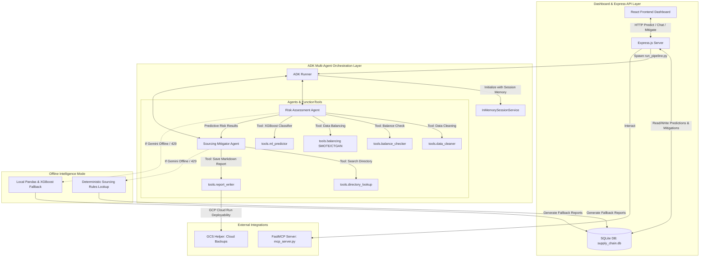

# ASBA: Autonomous Supply Chain Bottleneck Agent

ASBA is an autonomous agentic supply chain risk analyst designed for garment manufacturing companies. By combining predictive machine learning classification (XGBoost) with generative multi-agent reasoning (Gemini), ASBA predicts late delivery risks on active orders and autonomously recommends and recalculates sourcing mitigations.

This project was built for the **Kaggle AI Agents: Intensive Vibe Coding Capstone Project** with Google.

---

## 🏗️ System Architecture

ASBA leverages a **Multi-Agent Coordination System** built on Google's GenAI SDK and Model Context Protocol (MCP), coordinated programmatically via the Google Agent Development Kit (ADK).



### 🔁 The Orchestration Workflow
1. **Trigger:** A daily cron job or user request triggers [run_pipeline.py](file:///d:/Project%20Capstone%20Kaggle/backend/run_pipeline.py) which executes the ADK Multi-Agent Loop.
2. **Risk Assessment Agent (Risk Analyst):** Runs data validation tools, handles severe class imbalances (minority class ~7.5% Late delivery status) using SMOTE or Conditional GAN (CTGAN) synthesis, and trains an XGBoost classifier to predict delivery status.
3. **Sourcing Mitigator Agent (Sourcing Specialist):** Takes high-risk predictions, queries the B2B supplier directory for material shortages (e.g. Fabric, Threads, Trims), performs cost-exposure analysis, and drafts tailored remediation advice.
4. **Vite + React Dashboard & Express API:** Displays risk metrics, distribution charts, and lists of active orders. Users can trigger predictions and click "Mitigate" to upgrade carriers, shift mills, or reassign suppliers, executing instant model re-inference to recalculate risks.

---

## 🎓 Applied Course Concepts

ASBA implements **five core concepts** from the Google AI Agents course:

### 1. ADK Multi-Agent Orchestration (Agent Development Kit)
We migrated the entire multi-agent loop from manual prompting to Google's official `google-adk` framework.
- **`Agent`**: Encapsulates system instructions and specific model parameters for both the `RiskAssessmentAgent` and `SourcingMitigatorAgent`.
- **`FunctionTool`**: Decorates and exposes native Python utility modules (data cleaning, prediction, supplier search) as agent tools.
- **`Runner`**: Executes agent invocation flows programmatically, handling the sequential handover of state from the Analyst to the Mitigator.

### 2. Session Memory & Retention
To ensure smooth conversational interfaces, ASBA leverages ADK's `InMemorySessionService`.
- Chat contexts are tracked using a unique `session_id`.
- Conversational history is modeled as ADK `Event` logs and fed back to the Sourcing Specialist model on each turn.
- This allows the Sourcing Specialist to remember previously mitigated orders, answer follow-up questions, and compare multiple sourcing alternatives contextually.

### 3. FastMCP Server Integration
ASBA exposes its core supply chain tools via a **Model Context Protocol (MCP)** server built with python's `mcp` library:
- Exposes tools like `search_supplier_directory` and `train_and_predict_risk` to external LLM clients.
- Enables agent tool sharing, allowing third-party tools (like Cursor, Claude Desktop, or custom MCP gateways) to inspect and run supply chain mitigations natively.

### 4. Double-Layer Input Regex Sanitization
To safeguard database writes and prevent prompt injection, ASBA implements a strict input validation policy:
- **Express Layer**: Validates API request parameters using Express middleware before passing arguments to child processes.
- **Python ML/Agent Layer**: Re-sanitizes inputs using strict compiled regular expressions (e.g., matching `ORD-\d{8}-[A-Z0-9]+` patterns for Order IDs and alphanumeric strings for Supplier IDs) before querying the SQLite database or passing data to XGBoost model inference.

### 5. GCP Cloud Run & Cloud Storage Deployability
ASBA is fully optimized for cloud execution:
- **Multi-Stage Dockerfile**: Builds the React static assets, copies the node and Python runtime environment, installs packages, and boots the backend server.
- **Keyless Vertex AI Integration**: Uses Google Application Default Credentials (ADC) to authenticate against Vertex AI API securely without hardcoded keys.
- **GCS Backup Helpers**: Integrates with Google Cloud Storage (`tools/gcs_helper.py`) to sync daily JSON reports and the SQLite database to a cloud bucket, maintaining persistent state across serverless container restarts.

---

## 📴 Offline Intelligence Mode (Local Fallback)

To prevent downtime during Gemini API outages or rate limit (`RESOURCE_EXHAUSTED` 429) exhaustion:
- The system catches LLM connection errors and automatically switches to **Offline Intelligence Mode**.
- **Local Predictive Inference**: Runs local Python machine learning predictions using the pre-trained XGBoost model (`xgb_model.json`).
- **Deterministic Rules Lookup**: Scans the SQLite B2B supplier directory and applies a hardcoded rules engine to recommend the lowest-risk supplier matching the required fabric/thread bottleneck.
- **Seamless UI integration**: The frontend dashboard displays warnings that the agent is in offline mode while keeping 100% of the prediction, mitigation, and chart-rendering features fully operational.

---

## 📂 Directory Structure

Here is an overview of the reorganized project layout:

```text
d:/Project Capstone Kaggle
├── agent/                       # ADK Multi-Agent definition and loop
│   ├── __init__.py
│   ├── react_loop.py            # Primary ADK agent runner & model discovery
│   └── tool_definitions.py      # Combines tools for Analyst and Mitigator
├── backend/                     # Node.js API server & Python entrypoints
│   ├── chat_agent.py            # Chat interface wrapper using ADK Session
│   ├── mitigate_order.py        # Updates database & re-runs model prediction
│   ├── run_pipeline.py          # Script execution for the daily risk pipeline
│   ├── server.js                # Express API server serving frontend static files
│   ├── package.json
│   └── package-lock.json
├── daily_reports/               # CONSOLIDATED: Reports generated by the pipeline
│   ├── report_YYYYMMDD.json     # JSON payload for dashboard history
│   └── report_YYYYMMDD.md       # Markdown summary written by Sourcing Agent
├── data/                        # Active supply chain datasets & models
│   ├── supply_chain.db          # SQLite database storing raw, clean, predictions
│   ├── ml_metadata.pkl          # ML preprocessor metadata
│   ├── xgb_model.json           # Pre-trained XGBoost classifier model
│   └── *.csv                    # Synthetic CSVs (historical, directory, current)
├── frontend/                    # Vite + React Client application
│   ├── src/                     # App.jsx, index.css, main.jsx
│   ├── dist/                    # Compiled production UI static assets
│   ├── package.json
│   └── vite.config.js
├── tools/                       # Core python tools consumed by ADK
│   ├── balance_checker.py       # Scans class imbalance ratio
│   ├── balancing.py             # Oversampling using SMOTE/CTGAN
│   ├── data_cleaner.py          # Deduplicates, imputes, and caps outliers
│   ├── database.py              # SQLite context manager and initialization
│   ├── directory_lookup.py      # B2B Supplier Directory queries
│   ├── gcs_helper.py            # Syncs reports/database with GCS bucket
│   ├── ml_predictor.py          # Trains XGBoost and outputs prediction probabilities
│   └── report_writer.py         # Saves Sourcing specialist's markdown reports
├── .env.example
├── Dockerfile                   # Multi-stage production deployment configuration
├── docker-compose.yml           # Local container runner
├── deploy_gcp.sh                # Automation script for GCP Cloud Run
├── main.py                      # CLI entrypoint for local execution
├── mcp_server.py                # Python FastMCP server
└── requirements.txt             # Unified python virtual environment libraries
```

---

## 🛠️ Local Setup & Quickstart

### Prerequisites
- Python 3.10 or 3.11
- Node.js 18 or 20
- Google AI Studio API key (`GOOGLE_API_KEY`)

### 1. Clone & Install Dependencies
```bash
# Install Python ML dependencies
pip install -r requirements.txt

# Install Backend dependencies
cd backend
npm install
cd ..

# Install Frontend dependencies
cd frontend
npm install
cd ..
```

### 2. Configure Environment
Create a `.env` file in the project root:
```env
GOOGLE_API_KEY=AIzaSy... # Your Gemini API Key
USE_VERTEX_AI=false
```

Also, create or copy `.env` into the `backend/` directory:
```bash
cp .env backend/.env
```

### 3. Running the Agent CLI
ASBA provides a fully interactive Command Line Interface.
```bash
# Run the daily risk assessment pipeline (generates markdown report)
python main.py --assess

# Trigger a manual order mitigation and display cost comparison
python main.py --mitigate ORD-20260622-C0001 logistics

# Start a terminal chat session directly with the Sourcing Agent
python main.py --interactive
```

### 4. Running the Dashboard Web App
To run the full visual dashboard locally:
```bash
# Start backend Express server (localhost:5000)
cd backend
npm run dev

# Start frontend Vite server (localhost:5173) in a new terminal
cd frontend
npm run dev
```

---

## 🌐 Google Cloud Run Deployment

ASBA is fully containerized and configured for serverless deployment on Google Cloud Run.

### 1. Authenticate with Google Cloud
Ensure you have the Google Cloud CLI installed, then login and set your project:
```bash
gcloud auth login
gcloud config set project adroit-gravity-500216-r4
```

### 2. Deploy with One Command
Execute the deployment script to provision services, compile the container, deploy to Cloud Run, and bind the IAM permissions:
```bash
chmod +x deploy_gcp.sh
./deploy_gcp.sh
```
Upon completion, the script will output your public secure dashboard URL (e.g. `https://asba-service-xxxx-uc.a.run.app`).

---

## 🔌 Running the Python MCP Server

ASBA exposes its tools via a **Model Context Protocol (MCP)** server, allowing external AI clients (like Claude Desktop or Cursor) to call our supply chain risk assessment features natively.

To run the MCP server:
```bash
python mcp_server.py
```
This launches a standard FastMCP server over stdin/stdout. You can configure your AI editor or Claude Desktop config file to connect to it using:
```json
{
  "mcpServers": {
    "asba-supply-chain": {
      "command": "python",
      "args": ["/absolute/path/to/mcp_server.py"]
    }
  }
}
```
