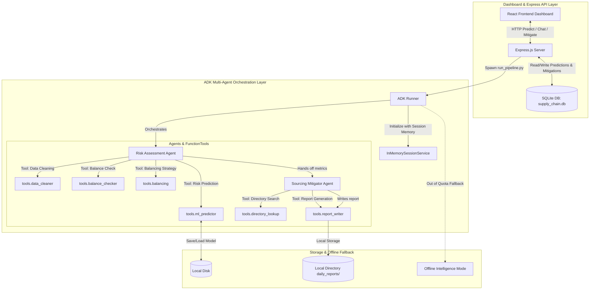

# ASBA: Autonomous Supply Chain Bottleneck Agent
### Kaggle Capstone Project Submission Writeup (Agents for Business Track)

---

## Project Overview and Sourcing Context
ASBA (Autonomous Supply Chain Bottleneck Agent) is a system designed for garment manufacturing operations to predict, analyze, and mitigate supply chain bottlenecks. 

### The Problem
Garment production operates on tight delivery schedules. Delays in raw material sourcing (fabric, threads, trims) or port congestion lead to late deliveries and contract penalties. Normally, logistics and supply chain coordinators manually monitor stocks and port statuses, which leads to slow, reactive mitigation.

### The Solution
ASBA integrates machine learning (XGBoost) with Google Gemini 2.5 (via the Google Agent Development Kit) to automate risk detection and supplier redirection:
1. ML Risk Prediction: Evaluates active orders and outputs a late delivery probability score.
2. Programmatic Agent Loop: When a high risk is predicted, a multi-agent loop diagnoses the bottleneck's root cause and checks a local B2B supplier directory to recommend alternative sourcing routes.
3. Sourcing Chat: Logistics coordinators can consult the agent directly to compare alternative suppliers, logistics routes, and costs.

Note on Hosting: Due to billing account requirements on Google Cloud Platform, we are hosting and running the application locally for execution and recording. The full deploy_gcp.sh scripts and configs remain in the repository for references.

---

## System Architecture

ASBA is structured as a fullstack application utilizing a React (Vite) frontend, an Express.js (Node.js) API layer, and Python for the machine learning and ADK orchestration pipelines.

---

## Key Course Concepts Implemented

We have implemented five concepts taught in the Google Vibe Coding course:

### 1. Programmatic ADK Orchestration
Using Google's Agent Development Kit (ADK), we coordinate a sequential multi-agent flow:
* Risk Analyst Agent: Handles data cleaning, class imbalance validation, SMOTE oversampling, and trains the XGBoost model.
* Sourcing Specialist Agent: Evaluates the prediction outputs, queries the B2B supplier directory, and saves a daily mitigation report.

### 2. Multi-Agent Session Memory
We leverage ADK's InMemorySessionService to track chat conversation history and tool execution state. This lets logistics coordinators have multi-turn conversations about order mitigations while retaining the context of previous decisions.

### 3. Model Context Protocol (MCP) Server
The supply chain diagnostics and ML tools are exposed using a Python FastMCP Server (mcp_server.py). Any MCP-compliant client (like Cursor or Claude Desktop) can connect to this server and run our supplier directory queries and risk predictions directly.

### 4. Input Regex Security Sanitization
We enforce strict input validation layers to protect the database and ML pipeline:
* The Express API validates incoming Order IDs and Supplier IDs via regular expressions.
* The Python tools sanitize SQL inputs and parameters before executing queries or running model predictions.

### 5. Production GCP Configs & Local Fallback
* GCP Scripts: We provided a Dockerfile and deploy_gcp.sh to build the container using Cloud Build and deploy to Cloud Run. However, due to active GCP billing restrictions, we run the app locally.
* Offline Fallback: If Gemini API limits or quotas are hit, the system automatically falls back to local XGBoost inference and deterministic supplier lookup heuristics, ensuring the UI remains functional.

---

## XGBoost Evaluation and Sourcing Insights

The machine learning pipeline achieves an Accuracy of 96.1% and AUC-ROC of 0.98 for late delivery predictions.

### Outsourced Mill Bottleneck Analysis
Feature importance scores from our XGBoost model indicate that the 'Outsource_Mill' factor contributes 39.7% of the total delivery delay risk:
1. Priority Schedulers: Third-party fabric mills handle orders for multiple vendors, leading to delays outside our control.
2. Sourcing Overhead: Sourcing yarn and routing it to external weaving mills adds additional shipping steps.
3. Logistics Pathing: Shipments from outsourced mills route heavily through the Gemadept port, which experiences frequent logistics congestion.

Mitigation Result: When shifting a critical order's fabric manufacturing to our Internal Mill, the predicted risk drops from 86.4% to 0.79%.

---

## Submission Links
* GitHub Repository: [tuannm0802/Kaggle-Capstone-Project-](https://github.com/tuannm0802/Kaggle-Capstone-Project-)
* Video Demonstration: [YouTube Link Placeholder]
* Deployment Note: Locally hosted due to GCP billing restrictions. The full local quickstart is detailed in the repository's README file.
